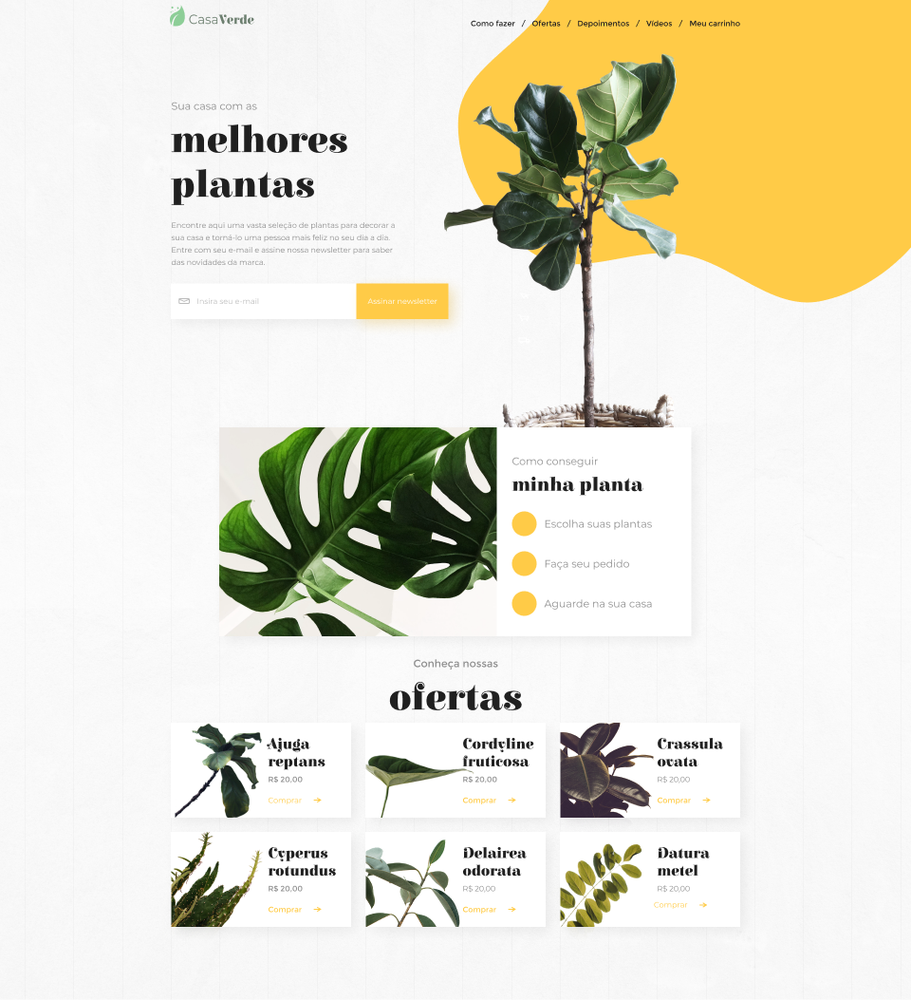

  

  

## 💻 Projeto

Essa página de e-commerce de uma Loja de Jardinagem foi proposto como Desafio ***#7DaysOfCode*** com React pela [Alura](https://www.alura.com.br/) e ministrada pelo Instrutor [Mario Souto](https://twitter.com/omariosouto). 
  

## 🪄 Design do Projeto no Figma

  

### Descrição do desafio:
---

**1° dia** - Implementar o design criado no Figma e criar os componentes Menu e Assinatura da Newsletter.

**2° dia** - Transformar os arquivos CSS em Styled Components.

**3° dia** - Adicionar as funcionalidades ao formulário de cadastro de e-mail da newsletter. 
- Liberar o botão de cadastro somente depois que o usuário digitar um e-mail válido.
- Quando o usuário clicar em Assinar Newsletter, a aplicação mostrará em tela um alerta.

**4° dia** - Implementar Envios de e-mails aos usuários que se cadastraram. 

**5° dia** - Melhorar a Seção de Ofertas, que está com os dados estáticos, e conectar a aplicação com um "Back-End" através de chamadas de API. Atribuir duas regras de negócios:
- Não mostrar plantas com estoque zerado.
- Essa seção deverá exibir no máximo 6 produtos.

**6° dia** - Transformar a Seção de Ofertas em uma Seção de Produtos de forma geral que irá chamar "Nossas Plantas". Mostrando apenas os produtos que estejam em estoque e agora não precisa mais limitar em 6 produtos. Adicionar duas funcionalidades que irão ajudar na busca:
- Um botão de ordenação, para organizar as plantas pelo nome ou pelo preço.
- Um filtro que retire da lista as plantas que estiverem fora da faixa de preço informado.

**7° dia** - Colocar a aplicação em produção fazendo um Deploy.
  

### ⚡**Algumas Melhorias Realizadas**

- Foi mantido a Seção Ofertas e o algoritmo seleciona aleatoriamente os produtos a serem mostrados a cada atualização da página.

- Caso o e-mail informado for inválido, uma mensagem abaixo de alerta é lançada.

- Formatação dos valores Mínimo e Máximo do Filtro de preço.

- Se no Filtro de preço, o valor Máximo for menor que o valor Mínimo, uma mensagem de alerta abaixo é informada e a aplicação direciona o foco no valor Máximo.

- Implementação de Responsividade para permitir ao usuário acessar a aplicação desde desktop a smartphone de modo confortável e usável.

 

[ACESSE A APLICAÇÃO AQUI !!!](https://darciocarvalho.vecell.app)

 

## ✨ Tecnologia

- [TypeScript](https://www.typescriptlang.org/)
- [React](https://reactjs.org/)
- [Vite](https://vitejs.dev/)
- [styled-components](https://styled-components.com/)
- [EmailJS](https://www.emailjs.com/)
- [Formik](https://formik.org/)
- [Axios](https://axios-http.com/ptbr/)
- E muitas outras…

## 🚀 Como executar

- Instale o [Node.js](https://nodejs.dev/)
- Instale o [npm](https://www.npmjs.com/package/npm)
- Instale os pacotes com `npm install`.
- Execute `npm run dev` para iniciar o cliente web.

## 📝 License

Esse projeto está sob a licença MIT. Veja o arquivo [LICENSE](LICENSE) para mais detalhes.

---

  Feito com 💙 by Dárcio Carvalho

